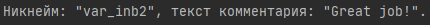
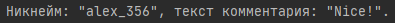
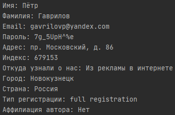

# Содержание
- [ИСР № 3](#инвариативная-самостоятельная-работа--3)
    - [1 задание](#31-разработка-классов-и-объектов-запись-комментарий-для-приложения-блог-использование-наследования)
    - [2 задание]
- [ВСР № 3](#вариативная-самостоятельная-работа--3)

# Инвариативная самостоятельная работа № 3
### [3.1. Разработка классов и объектов «запись», «комментарий» для приложения «Блог» (использование наследования).](https://repl.it/@Rakleed/programming4-indepworkinvar3-1)
```python
"""
    Автор: Моисеенко Павел, группа № 1, подгруппа № 2.

    ИСР 3.1. Задание: разработать классы и объекты «запись»,
    «комментарий» для приложения «Блог» (использую наследование).

"""


class Post:
    def __init__(self, author, post_text):
        self.__author = author
        self.__post_text = post_text

    def show_comment(self, comment=object):
        print(f'Никнейм: "{comment.nickname}", текст комментария: "{comment.comment_text}".')


class Comment(Post):
    def __init__(self, nickname, comment_text):
        self.nickname = nickname
        self.comment_text = comment_text


post_test = Post("Иван Александров", "Какая-то интересная статья.")
comment_test = Comment("var_inb2", "Great job!")
post_test.show_comment(comment=comment_test)
```


### [3.2. Создание геттеров и сеттеров для классов «запись», «комментарий» приложения «Гостевая книга», а также функций для вывода на печать информации, хранящийся в объектах.](https://repl.it/@Rakleed/programming4-indepworkinvar3-2)
```python
"""
    Автор: Моисеенко Павел, группа № 1, подгруппа № 2.

    ИСР 3.2. Задание: создать геттеры и сеттеры для классов «запись»,
    «комментарий» приложения «Гостевая книга», а также функции для
    вывода на печать информации, хранящийся в объектах.

"""


class Post:
    def __init__(self, author, post_text):
        self.__author = author
        self.__post_text = post_text

    def show_comment(self, comment=object):
        print(f'Никнейм: "{comment.nickname}", текст комментария: "{comment.comment_text}".')


class Comment(Post):
    def __init__(self, nickname, comment_text):
        self.__nickname = nickname
        self.__comment_text = comment_text

    @property
    def nickname(self):
        return self.__nickname

    @nickname.setter
    def title(self, value):
        self.__nickname = str(value)

    @nickname.deleter
    def title(self):
        self.__nickname = None

    @property
    def comment_text(self):
        return self.__comment_text

    @comment_text.setter
    def comment_text(self, value):
        self.__comment_text = str(value)

    @comment_text.deleter
    def comment_text(self):
        self.__comment_text = None

    def show(self):
        print("Автор: " + str(self.author))
        print("Текст поста: " + str(self.post_text))


post_test = Post("Пётр Михайлов", "Какая-то классная статья.")
comment_test = Comment("alex_356", "Nice!")
post_test.show_comment(comment=comment_test)
```


# [Вариативная самостоятельная работа № 3](https://repl.it/@Rakleed/programming4-indepworkvar3)
```python
"""
    Автор: Моисеенко Павел, группа № 1, подгруппа № 2.

    ВСР 3. Задание: разработать прототип приложения «Регистрация на
    конференциюю на основе фрагмента технического задания
    с использованием ООП.

"""


class NewRegistration:
    def __init__(self, first_name="", second_name="", email="", password="", address="",
                 source_info="", postal_code="", city="", country="", regtype="",
                 affiliation=""):
        self.__first_name, self.__email, self.__second_name, self.__password, \
        self.__source_info, self.__address, self.__city, self.__country, \
        self.__regtype, self.__affiliation, \
        self.__postal_code = first_name, email, second_name, password, source_info, \
                             address, city, country, regtype, affiliation, \
                             postal_code

    @property
    def first_name(self):
        return self.__first_name

    @first_name.setter
    def first_name(self, new_first_name):
        if new_first_name != "":
            self.__first_name = new_first_name
        else:
            raise ValueError("Поле «Имя» не может быть пустым.")

    @property
    def second_name(self):
        return self.__second_name

    @second_name.setter
    def second_name(self, new_second_name):
        if new_second_name != "":
            self.__second_name = new_second_name
        else:
            raise ValueError("Поле «Фамилия» не может быть пустым.")

    @property
    def password(self):
        return self.__password

    @password.setter
    def password(self, new_password):
        if len(new_password) < 8:
            raise ValueError("Произошла ошибка, пароль введен некорректно.")
        else:
            self.__password = new_password

    @property
    def email(self):
        return self.__email

    @email.setter
    def email(self, new_email):
        if not isinstance(new_email, str):
            raise ValueError("Произошла ошибка, email введен некорректно.")
        else:
            self.__email = new_email

    @property
    def source_info(self):
        return self.__source_info

    @source_info.setter
    def source_info(self, new_source_info):
        if (isinstance(new_source_info, str)) and (len(new_source_info) > 100):
            self.__source_info = new_source_info
        else:
            raise ValueError("Информация введена некорректно.")

    @property
    def postal_code(self):
        return self.__postal_code

    @postal_code.setter
    def postal_code(self, new_postal_code):
        if not isinstance(new_postal_code, str):
            raise ValueError("Индекс введен некорректно.")
        else:
            self.__postal_code = new_postal_code

    @property
    def city(self):
        return self.__city

    @city.setter
    def city(self, new_city):
        if not isinstance(new_city, str):
            raise ValueError("Город введен некорректно.")
        else:
            self.__city = new_city

    @property
    def country(self):
        return self.__country

    @country.setter
    def country(self, new_country):
        if not isinstance(new_country, str):
            raise ValueError("Государство введено некорректно.")
        else:
            self.__country = new_country

    @property
    def affiliation(self):
        return self.__affiliation

    @affiliation.setter
    def affiliation(self, new_affiliation):
        if (isinstance(new_affiliation, str)) and (len(new_affiliation) >
                                                   150):
            self.__affiliation = new_affiliation
        else:
            raise ValueError("Аффиляция введена некорректно.")

    @property
    def address(self):
        return self.__address

    @address.setter
    def address(self, new_address):
        if (isinstance(new_address, str)) or (len(new_address) > 10):
            self.__address = new_address
        else:
            raise ValueError("Адрес должен быть длиннее 10 символов.")

    @property
    def regtype(self):
        return self.__regtype

    @regtype.setter
    def regtype(self, new_regtype):
        if not (isinstance(new_regtype, str)) or \
                (new_regtype != "IEEE members") or \
                (new_regtype != "full registration"):
            raise ValueError("Информация введена некорректно.")
        else:
            self.__regtype = new_regtype

    def __repr__(self):
        string_1 = 'Имя: {0}\nФамилия: {1}\nEmail: {2}\nПароль: {3}\nАдрес:' \
                   ' {4}\nИндекс: {5}\n'
        string_2 = 'Откуда узнали о нас: {6}\nГород: {7}\nСтрана: {8}\nТип ' \
                   'регистрации: {9}\nАффилиация автора: {10}'
        return (string_1 + string_2).format(self.first_name, self.second_name,
                                            self.email, self.password,
                                            self.address, self.postal_code,
                                            self.source_info, self.city,
                                            self.country, self.regtype,
                                            self.affiliation)


test_user_1 = NewRegistration('Пётр', 'Гаврилов', 'gavrilovp@yandex.com', '7g_5UpH^%e',
                              'пр. Московский, д. 86', 'Из рекламы в интернете',
                              '679153', 'Новокузнецк', 'Россия', 'full registration',
                              'Нет')
print(test_user_1)
```

